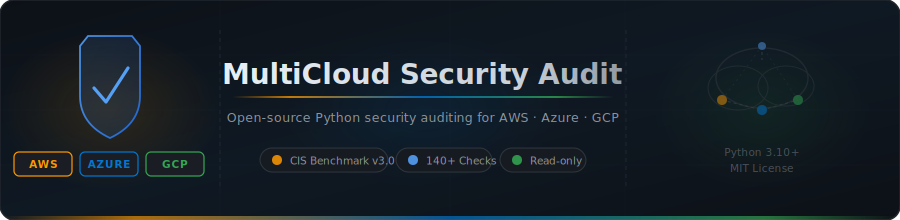

<p align="center">
  
</p>

<p align="center">
  
  
  
  
  
  
  
</p>

---

## Overview

A ScoutSuite-inspired, Python-native multi-cloud security auditing tool. Connects to live AWS, Azure, and GCP accounts via provider SDKs, evaluates configurations against a library of JSON rule files, and generates an interactive HTML report with posture scoring, compliance mapping, remediation playbooks, SARIF output, and CI/CD integration.

| Provider | Services | Rules | Benchmarks |
|----------|----------|-------|------------|
| **AWS**   | 16 (IAM, S3, EC2, RDS, Lambda, EKS, ECR, Secrets Manager, OpenSearch, CloudTrail, KMS, GuardDuty, VPC, Config, SNS, SQS) | 37 | CIS AWS Foundations v3.0 |
| **Azure** | 12 (Entra ID, Storage, Key Vault, Compute, Network, SQL, Monitor, Security, App Service, AKS, Container Registry, Cosmos DB) | 33 | CIS Azure Foundations v2.0 |
| **GCP**   | 9 (IAM, GCS, Compute, SQL, Logging, KMS, GKE, BigQuery, Cloud Functions) | 28 | CIS GCP Foundations v2.0 |

**98 total rules** across 37 services and 3 cloud providers.

---

## Quick Start

```bash
git clone https://github.com/Krishcalin/MultiCloud-Security-Audit-Tool.git
cd MultiCloud-Security-Audit-Tool
pip install -r requirements.txt

# Demo — no credentials needed
python scout.py demo --html report.html

# AWS live audit
python scout.py aws --region us-east-1 --html aws_report.html

# Azure live audit
python scout.py azure --subscription-id <SUB_ID> --html azure_report.html

# GCP live audit
python scout.py gcp --project <PROJECT_ID> --html gcp_report.html
```

---

## Features

### Security Posture Score
Every scan produces a **0–100 posture score** with letter grade (A–F) based on finding severity:

| Severity | Penalty | Grade | Score |
|----------|---------|-------|-------|
| CRITICAL | 40 pts  | A | 90–100 |
| HIGH     | 15 pts  | B | 75–89  |
| MEDIUM   | 5 pts   | C | 60–74  |
| LOW      | 1 pt    | D | 40–59  |
| INFO     | 0 pts   | F | 0–39   |

### Compliance Scorecard
Findings are automatically mapped to compliance frameworks: **CIS Benchmarks**, **PCI-DSS**, **HIPAA**, **SOC 2**, **ISO 27001**, **NIST CSF**, **AWS Well-Architected**.

### Remediation Playbooks
For every finding, auto-generated **CLI fix commands** are embedded in the HTML report and exportable as a shell script:

```bash
python scout.py aws --region us-east-1 --remediation-script fix.sh
```

### Exception Management
Suppress false positives via a YAML exceptions file without touching rule definitions:

```yaml
# exceptions.yaml
suppressions:
  - rule_id: SM-01
    resource: "prod/db/password"
    reason: "Rotation managed by HashiCorp Vault"
    expires: "2026-12-31"
```

```bash
python scout.py aws --exceptions exceptions.yaml --html report.html
```

### SARIF Output
Export findings in **SARIF 2.1.0** format for GitHub Code Scanning, GitLab, or VS Code:

```bash
python scout.py aws --sarif results.sarif
```

### JUnit XML Output
CI pipeline gate integration — CRITICAL/HIGH findings become test failures:

```bash
python scout.py aws --junit results.xml
```

---

## CLI Reference

```
usage: scout.py [-h] [--version] PROVIDER ...

Providers:
  demo    Sample report — no credentials required
  aws     Live AWS account audit
  azure   Live Azure subscription audit
  gcp     Live GCP project audit

Common options (all providers):
  --html FILE               HTML report output
  --json FILE               JSON findings output
  --sarif FILE              SARIF 2.1.0 output (GitHub Code Scanning)
  --junit FILE              JUnit XML output (CI pipeline gate)
  --exceptions FILE         YAML suppressions file
  --remediation-script FILE Shell script with CLI fix commands
  -v, --verbose             Verbose progress output

AWS options:
  --region REGION           AWS region (default: eu-west-1)
  --profile PROFILE         Named AWS credentials profile
  --sections SECTION ...    Scan specific services only
  --ruleset FILE            Custom ruleset JSON

Azure options:
  --subscription-id SUB_ID
  --tenant-id TENANT_ID
  --client-id CLIENT_ID
  --client-secret SECRET

GCP options:
  --project PROJECT_ID
  --service-account-file FILE
```

**Exit codes:** `0` = no CRITICAL/HIGH findings · `1` = CRITICAL or HIGH present · `2` = error

---

## Architecture

```
MultiCloud-Security-Audit-Tool/
├── scout.py                        # CLI entrypoint (argparse subcommands)
├── requirements.txt
├── exceptions.yaml.template        # Suppressions file template
├── .github/workflows/
│   └── scout-scan.yml              # GitHub Actions CI/CD workflow
├── core/
│   ├── finding.py                  # Finding dataclass
│   ├── conditions.py               # 30+ condition operators
│   ├── rule.py                     # RuleDefinition + Rule
│   ├── ruleset.py                  # Ruleset loader
│   ├── engine.py                   # ProcessingEngine
│   ├── scoring.py                  # Posture score (0-100, A-F grade)
│   ├── compliance.py               # Compliance framework aggregation
│   └── exceptions.py               # Exception/suppression management
├── output/
│   ├── encoder.py                  # JSON serialisation
│   ├── report.py                   # Interactive HTML report generator
│   ├── sarif.py                    # SARIF 2.1.0 writer
│   ├── junit.py                    # JUnit XML writer
│   └── remediation.py              # CLI remediation command generator
└── providers/
    ├── base/                       # Abstract base classes
    ├── aws/                        # 16 services · 37 rules
    │   ├── facade.py               # boto3 wrapper (paginate/call helpers)
    │   ├── provider.py
    │   ├── services/               # iam, s3, ec2, vpc, rds, kms, cloudtrail,
    │   │                           # guardduty, config, sns, sqs, lambda_,
    │   │                           # eks, ecr, secretsmanager, opensearch
    │   └── rules/                  # 37 JSON rule files + aws-cis-3.0-ruleset.json
    ├── azure/                      # 12 services · 33 rules
    │   ├── facade.py               # Azure SDK + Microsoft Graph helpers
    │   ├── provider.py
    │   ├── services/               # entra, storage, keyvault, compute, network,
    │   │                           # sql, monitor, security, appservice,
    │   │                           # aks, containerregistry, cosmosdb
    │   └── rules/                  # 33 JSON rule files + azure-cis-2.0-ruleset.json
    └── gcp/                        # 9 services · 28 rules
        ├── facade.py               # Discovery API wrapper
        ├── provider.py
        ├── services/               # iam, storage, compute, sql, logging, kms,
        │                           # gke, bigquery, functions
        └── rules/                  # 28 JSON rule files + gcp-cis-2.0-ruleset.json
```

### How it works

```
CLI (scout.py)
  └── Provider.fetch_sync()         — calls cloud APIs, builds data dict
        └── ProcessingEngine.run()
              └── For each Rule in Ruleset:
                    walk data[rule.path]  (supports * wildcard)
                      evaluate conditions(rule.conditions, item)
                        → Finding(rule_id, severity, service, flagged_items)
  └── apply_exceptions()            — suppress matched findings
  └── compute_score()               — 0-100 posture score + A-F grade
  └── aggregate_compliance()        — per-framework finding counts
  └── save_html()                   — interactive HTML report
  └── save_sarif()                  — SARIF 2.1.0
  └── save_junit()                  — JUnit XML
  └── save_remediation_script()     — CLI fix script
```

---

## Rule Format

Each security check is a single JSON file:

```json
{
  "id":          "RDS-01",
  "name":        "RDS instance publicly accessible",
  "description": "The RDS database instance is configured with PubliclyAccessible=true.",
  "severity":    "CRITICAL",
  "service":     "rds",
  "path":        "rds.instances.*",
  "conditions":  ["PubliclyAccessible", "true"],
  "remediation": "Set PubliclyAccessible=false. Place RDS in private subnets.",
  "compliance":  [{"name": "CIS AWS Foundations", "version": "3.0", "reference": "2.3.3"}],
  "references":  ["https://docs.aws.amazon.com/AmazonRDS/latest/UserGuide/UsingWithRDS.html"]
}
```

---

## CI/CD Integration

The included GitHub Actions workflow (`.github/workflows/scout-scan.yml`) runs parallel security scans on all three clouds:

- Triggered on push to `main`, pull requests, weekly schedule, and manual dispatch
- Uploads SARIF results to **GitHub Code Scanning** (requires GitHub Advanced Security)
- Publishes **JUnit test results** in the Checks tab
- Uploads HTML reports and JSON findings as **workflow artifacts**
- Posts a **summary comment** on pull requests

Configure these repository secrets:

| Secret | Provider |
|--------|----------|
| `AWS_ROLE_ARN` | AWS (OIDC) |
| `AZURE_SUBSCRIPTION_ID`, `AZURE_TENANT_ID`, `AZURE_CLIENT_ID`, `AZURE_CLIENT_SECRET` | Azure |
| `GCP_PROJECT_ID`, `GCP_SERVICE_ACCOUNT_KEY` | GCP |

---

## Requirements

| Scope | Packages |
|-------|----------|
| Demo (no cloud) | Python 3.10+ — stdlib only |
| AWS | `boto3>=1.34` |
| Azure | `azure-identity`, `azure-mgmt-compute/storage/network/resource/authorization/keyvault/monitor/security/sql/containerservice/containerregistry/cosmosdb`, `msgraph-sdk` |
| GCP | `google-auth`, `google-api-python-client`, `google-auth-httplib2`, `google-cloud-storage` |
| Exceptions file | `pyyaml>=6.0` |

```bash
pip install -r requirements.txt
```

---

## Disclaimer

For **authorised security assessments only**. The tool makes read-only API calls and never modifies cloud resources. Always ensure you have explicit authorisation before scanning.

---

## License

MIT License
